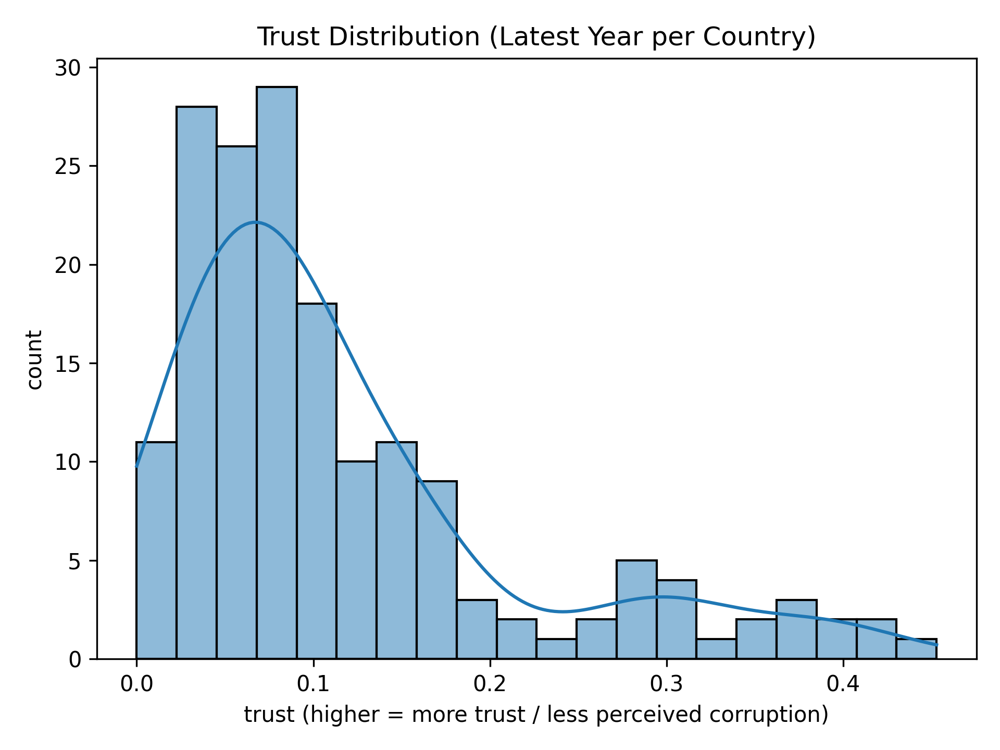
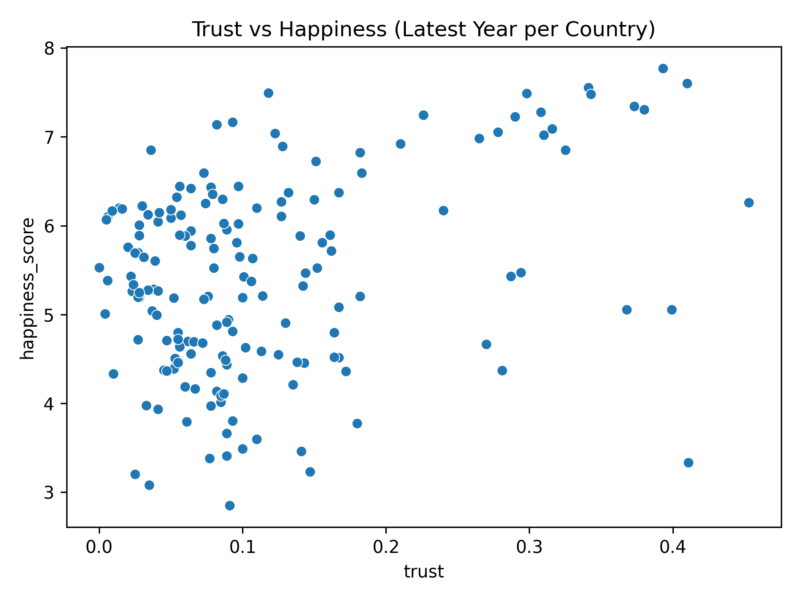
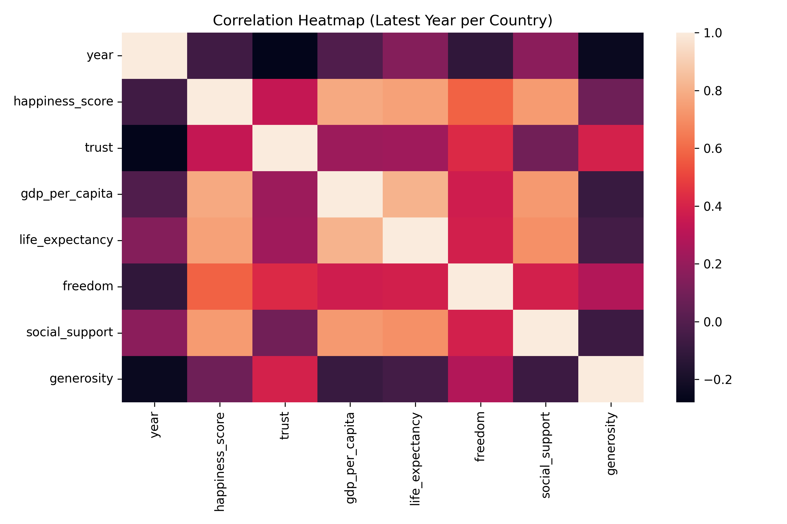

# Lab 1 - Statistical Foundations: Trust and Happiness

## 1. Context (What)
This lab builds on Lab 0 by moving from dataset understanding to a first measurable relationship. We focus on the trust/corruption proxy across 2015-2019 and relate it to the happiness score. Because column names change by year, we normalize them into a consistent schema and then analyze a country-level snapshot using the latest available year per country.

## 2. Objective (Why)
A linear regression pipeline needs a reliable baseline relationship before we add more features. Trust is a core social factor in the dataset and a meaningful candidate for a first regression baseline. This step establishes how strongly trust alone aligns with happiness and sets a statistical foundation for later feature expansion.

## 3. Methodology (How)
Tools and libraries:
- pandas, numpy for loading and computation
- matplotlib, seaborn for visual diagnostics

Techniques introduced:
- Column normalization across years (2015-2019)
- Latest-year snapshot per country to reduce time-related bias
- Descriptive statistics to summarize trust distribution
- Pearson correlation to quantify linear association
- Simple linear regression: happiness_score ~ trust

Why these choices:
- Correlation and simple regression provide an interpretable baseline and help validate whether trust is a plausible predictor before adding multivariate complexity.

## 4. Implementation Summary
- Loaded all CSVs from data/raw and inferred year from filename.
- Mapped inconsistent column names to a single schema.
- Converted numeric columns to numeric types with coercion for missing values.
- Built a latest-year snapshot per country.
- Computed trust distribution, top/bottom countries, correlation, and a simple regression fit.
- Produced diagnostic plots (distribution, scatter, correlation heatmap).

## 5. Results and Interpretation
Compared to Lab 0, we move from qualitative understanding to quantitative evidence. The trust proxy shows a positive relationship with happiness in the snapshot, and the regression slope gives a baseline sensitivity of happiness to trust. The R^2 highlights how much variance trust alone can explain, motivating multivariate modeling in future labs.

Run the notebook to view exact coefficients and diagnostics for this dataset.

Key plots:
- Trust distribution: 
- Trust vs happiness: 
- Correlation heatmap: 

## 6. Outputs
Folder structure for this lab:
```
lab1/
	outputs/
		plots/
			lab1_plot_trust_distribution.png
			lab1_plot_trust_vs_happiness.png
			lab1_plot_correlation_heatmap.png
		tables/
			lab1_top10_trust.csv
			lab1_bottom10_trust.csv
```

## 7. References
See [references.md](references.md) for the resources used in this lab.
