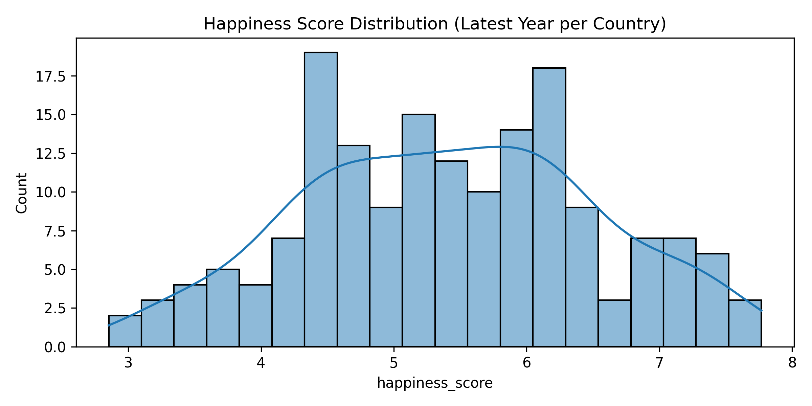
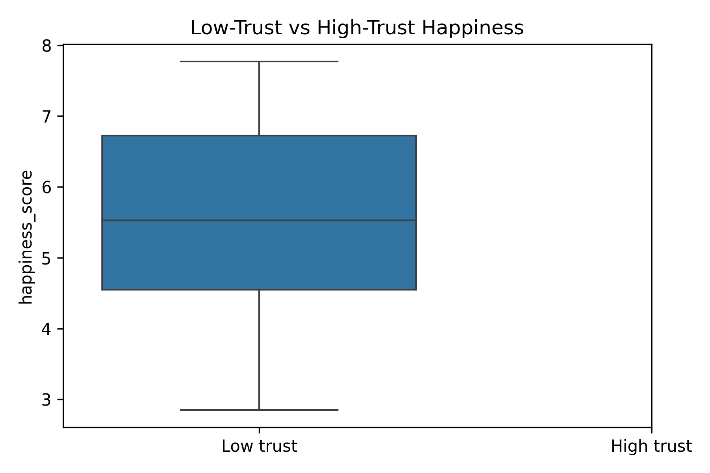

# Lab 2 - Inferential Statistics for Happiness

## 1. Context (What)
This lab extends Lab 1 by adding inferential statistics. We move from descriptive correlation to statistical confidence in what the data is telling us about happiness. The dataset remains the World Happiness Report (2015-2019), normalized across years.

## 2. Objective (Why)
Before we build predictive models, we need to quantify uncertainty. This lab introduces confidence intervals and hypothesis tests so we can reason about whether observed differences (for example, high-trust vs low-trust countries) are likely to be real.

## 3. Methodology (How)
Tools and libraries:
- pandas, numpy for data handling
- scipy.stats for inferential tests
- matplotlib, seaborn for visualization

Techniques introduced:
- Confidence interval for mean happiness
- Bootstrap confidence interval
- Two-sample t-test between high-trust and low-trust groups
- Effect size (Cohen's d)

Why these choices:
- CI and hypothesis tests provide statistical grounding before we expand to multi-feature models.
- Effect size ensures we interpret practical impact, not just p-values.

## 4. Implementation Summary
- Loaded all CSVs, standardized columns, and created a latest-year snapshot per country.
- Computed CI for the mean happiness score using both parametric and bootstrap methods.
- Tested whether high-trust and low-trust groups differ in happiness and measured effect size.
- Visualized distributions and group differences.

## 5. Results and Interpretation
Compared to Lab 1, this lab adds uncertainty-aware reasoning. We now report ranges for the mean happiness score and test whether observed group differences are statistically significant. These results justify later feature modeling and help avoid overconfident conclusions.

Key plots:
- Happiness distribution: 
- Trust group comparison: 

## 6. Outputs
Folder structure for this lab:
```
lab2/
	outputs/
		plots/
			lab2_plot_happiness_distribution.png
			lab2_plot_trust_groups_boxplot.png
		tables/
			lab2_inferential_summary.csv
```

## 7. References
See [references.md](references.md) for the resources used in this lab.
