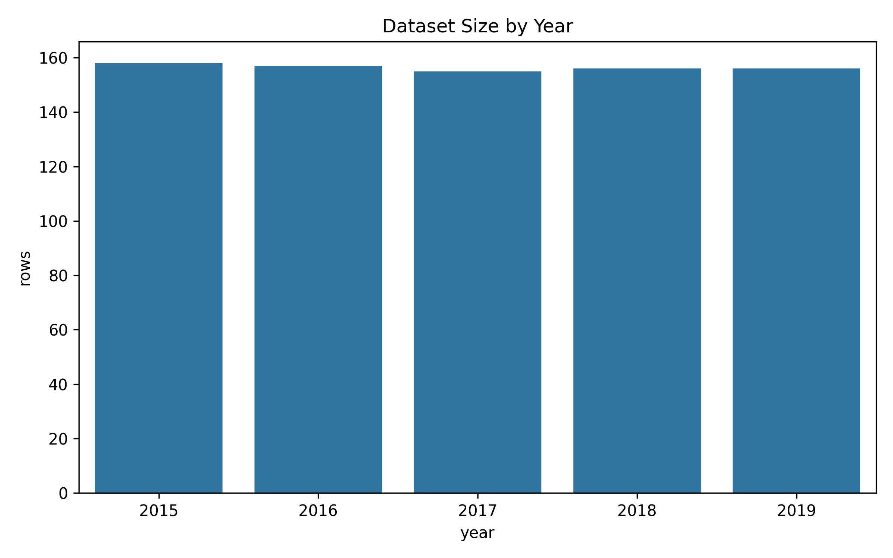

# Lab 3 - Data Acquisition and Provenance (Dataset Sources)

## 1. Context (What)
This lab documents the provenance of the World Happiness CSV files (2015-2019). We capture basic metadata about each file so later labs can be reproduced and audited.

## 2. Objective (Why)
A reliable ML pipeline needs traceable data sources. This lab shows how to automate provenance notes by scraping and structuring source metadata. This will support later labs where we need reproducibility and data auditing.

## 3. Methodology (How)
Tools and libraries:
- pandas for structured outputs
- pathlib and re for file handling and year inference
- matplotlib, seaborn for a small provenance plot

Techniques introduced:
- List raw CSV files and infer year from filename
- Capture file-level metadata (rows, columns, missing %)
- Store provenance metadata as a structured CSV

Why these choices:
- File-level metadata is lightweight and keeps the dataset untouched.
- Capturing source details makes later modeling steps easier to trust.

## 4. Implementation Summary
- Scanned the raw CSVs and inferred year from filenames.
- Collected file metadata (rows, columns, missing %).
- Saved provenance metadata to a CSV in lab outputs and data/processed.

## 5. Results and Interpretation
Compared to Lab 2, this lab adds a pipeline component focused on data sourcing rather than statistics. We now have a reproducible way to track which CSV files are used, which helps the final dashboard stay credible.

Key plot:
- Rows by year: 

## 6. Outputs
Folder structure for this lab:
```
lab3/
	outputs/
		plots/
			lab3_plot_rows_by_year.png
		tables/
			lab3_dataset_provenance.csv
```

## 7. References
See [references.md](references.md) for the resources used in this lab.
