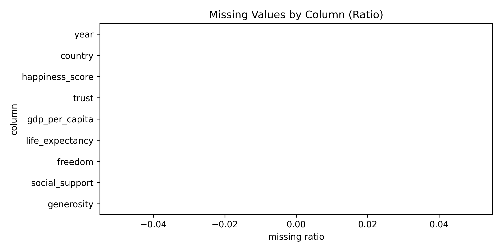

# Lab 4 - Data Cleaning and Preprocessing

## 1. Context (What)
This lab focuses on cleaning and preparing the dataset for modeling. We keep the same World Happiness data but introduce systematic preprocessing so later modeling steps are reproducible and consistent.

## 2. Objective (Why)
A linear regression model is only as good as its inputs. This lab reduces missing-value issues, standardizes features, and produces a model-ready dataset that future labs can reuse.

## 3. Methodology (How)
Tools and libraries:
- pandas, numpy for data handling
- scikit-learn for preprocessing utilities

Techniques introduced:
- Missing value inspection and imputation
- Feature scaling (standardization)
- Train-test split for model-ready structure

Why these choices:
- Imputation and scaling reduce bias and improve comparability across indicators.
- Train-test split prepares the pipeline for evaluation without leakage.

## 4. Implementation Summary
- Loaded and normalized all years, then created a latest-year snapshot.
- Selected numeric drivers plus target happiness_score.
- Split data before preprocessing to avoid leakage.
- Fit imputer and scaler on training data only, then transformed train/test.
- Saved train/test model-ready datasets into lab outputs and data/processed.

## 5. Results and Interpretation
Compared to Lab 3, this lab does not add new data sources but makes the dataset consistent and ready for modeling. This is the bridge between data understanding and predictive modeling.

Key plot:
- Missing values by column (empty because the latest-year snapshot has no missing values after loading): 

## 6. Outputs
Folder structure for this lab:
```
lab4/
	outputs/
		plots/
			lab4_plot_missing_values.png
		tables/
			lab4_missing_values.csv
			lab4_train_model_ready.csv
			lab4_test_model_ready.csv
```

## 7. References
See [references.md](references.md) for the resources used in this lab.
