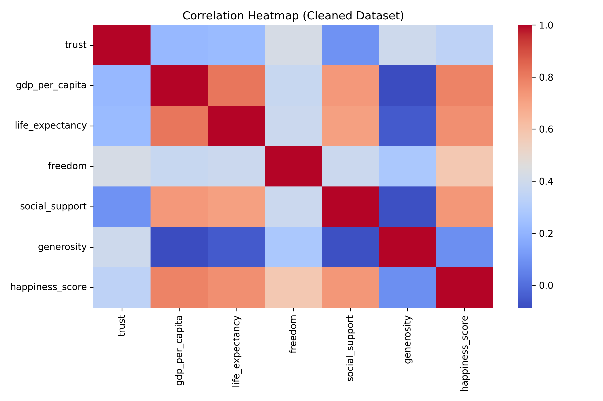
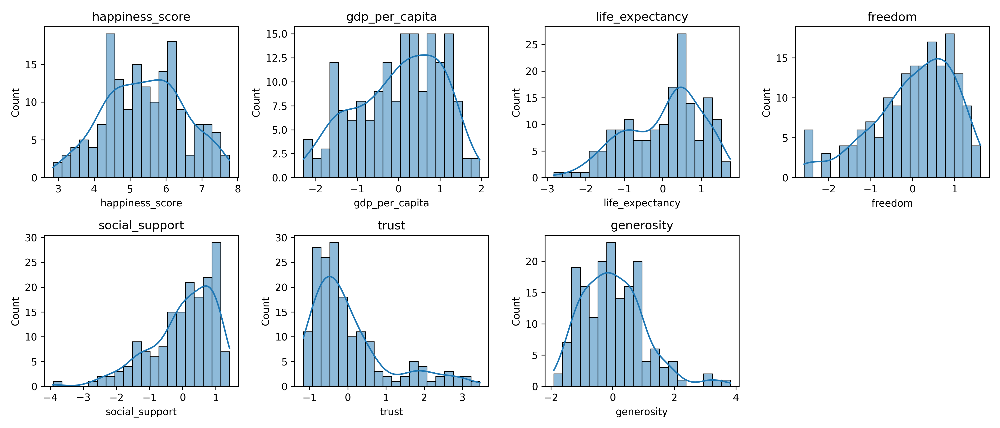

# Lab 5 - Exploratory Data Analysis (EDA)

## 1. Context (What)
This lab performs a deeper EDA on the cleaned dataset from Lab 4. We explore distributions and correlations to discover patterns that will guide modeling choices in later labs.

## 2. Objective (Why)
Before training a regression model, we need to understand which features are strongly related to happiness and whether the data contains skew, outliers, or collinearity. This lab builds that evidence.

## 3. Methodology (How)
Tools and libraries:
- pandas, numpy for data handling
- matplotlib, seaborn for visualization

Techniques introduced:
- Distribution plots for key indicators
- Correlation heatmap
- Summary statistics table

Why these choices:
- EDA provides the intuition and justification for feature selection and preprocessing decisions.

## 4. Implementation Summary
- Loaded the cleaned model-ready data from Lab 4 (train/test combined).
- Created summary statistics and visual diagnostics.
- Highlighted feature correlations with happiness.

## 5. Results and Interpretation
Compared to Lab 4, this lab explains which predictors appear most promising and which distributions may need further normalization. These findings feed directly into the modeling choices in Lab 6 and Lab 7.

Key plots:
- Correlation heatmap: 
- Feature distributions: 

Key tables:
- Summary statistics: outputs/tables/lab5_summary_stats.csv
- Correlation matrix: outputs/tables/lab5_correlation_matrix.csv

## 6. Outputs
Folder structure for this lab:
```
lab5/
	outputs/
		plots/
			lab5_plot_correlation_heatmap.png
			lab5_plot_feature_distributions.png
		tables/
			lab5_summary_stats.csv
			lab5_correlation_matrix.csv
```

## 7. References
See [references.md](references.md) for the resources used in this lab.
