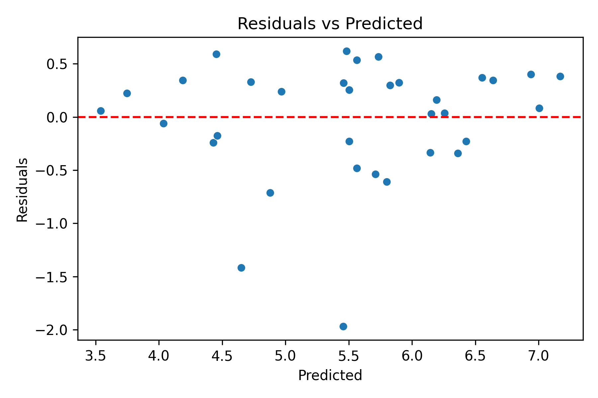

# Lab 6 - Model Evaluation and Validation

## 1. Context (What)
This lab introduces validation. Using the cleaned model-ready dataset from Lab 4, we evaluate a baseline linear regression with cross-validation and holdout metrics.

## 2. Objective (Why)
A model that looks good on one split can fail in practice. This lab introduces cross-validation, error metrics, and residual checks so we can trust the model before moving to full regression interpretation.

## 3. Methodology (How)
Tools and libraries:
- scikit-learn for modeling and metrics
- pandas, numpy for data handling

Techniques introduced:
- Train-test split
- K-fold cross-validation
- MAE, RMSE, and R^2 metrics
- Residual diagnostics

Why these choices:
- These metrics are standard for regression and provide an honest view of model generalization.

## 4. Implementation Summary
- Loaded the cleaned train/test datasets from Lab 4.
- Trained a baseline linear regression model.
- Computed metrics on holdout data and via cross-validation.
- Visualized residuals for diagnostic checks.

## 5. Results and Interpretation
Compared to Lab 5, this lab is the first place we evaluate predictive quality. The outputs will guide whether to adjust preprocessing or try regularization in Lab 7.

Key plot:
- Residuals vs predicted: 

Key tables:
- Holdout metrics: outputs/tables/lab6_holdout_metrics.csv
- Cross-validation scores: outputs/tables/lab6_cv_scores.csv

## 6. Outputs
Folder structure for this lab:
```
lab6/
	outputs/
		plots/
			lab6_plot_residuals.png
		tables/
			lab6_holdout_metrics.csv
			lab6_cv_scores.csv
```

## 7. References
See [references.md](references.md) for the resources used in this lab.
