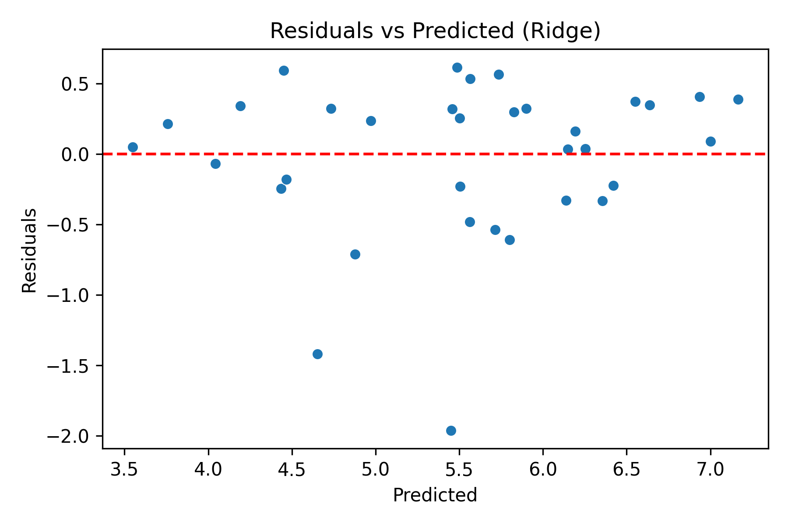

# Lab 7 - Linear Regression Modeling and Interpretation

## 1. Context (What)
This lab implements the final linear regression model. We compare OLS with regularized variants and interpret coefficients in the context of happiness drivers using the cleaned dataset from Lab 4.

## 2. Objective (Why)
The final goal is a deployable, interpretable linear regression model for the Streamlit dashboard. This lab establishes the best-performing and most interpretable model configuration.

## 3. Methodology (How)
Tools and libraries:
- scikit-learn for LinearRegression, Ridge, Lasso
- pandas, numpy for data handling
- matplotlib, seaborn for diagnostics

Techniques introduced:
- OLS vs Ridge vs Lasso comparison
- Coefficient interpretation
- Model metrics (MAE, RMSE, R^2)
- Residual analysis

Why these choices:
- Regularization helps control overfitting and improves generalization.
- Coefficient interpretation supports transparency for the final dashboard.

## 4. Implementation Summary
- Loaded the cleaned train/test datasets from Lab 4.
- Trained and compared OLS, Ridge, and Lasso.
- Reported metrics and coefficient tables.
- Generated residual plots.

## 5. Results and Interpretation
Compared to Lab 6, this lab goes beyond evaluation and selects the final model. The coefficient analysis becomes the core explanation for the Streamlit dashboard.

Key plot:
- Residuals vs predicted: 

Key tables:
- Model comparison: outputs/tables/lab7_model_comparison.csv
- OLS coefficients: outputs/tables/lab7_ols_coefficients.csv

## 6. Outputs
Folder structure for this lab:
```
lab7/
	outputs/
		plots/
			lab7_plot_residuals.png
		tables/
			lab7_model_comparison.csv
			lab7_ols_coefficients.csv
```

## 7. References
See [references.md](references.md) for the resources used in this lab.
